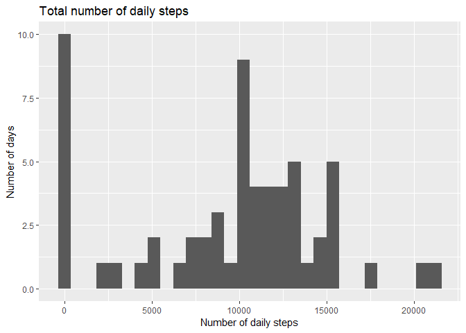
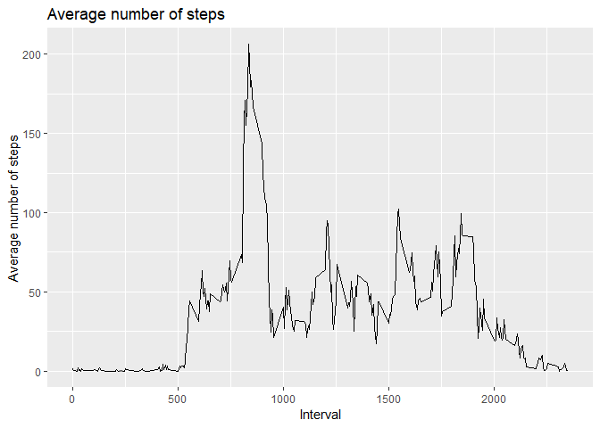
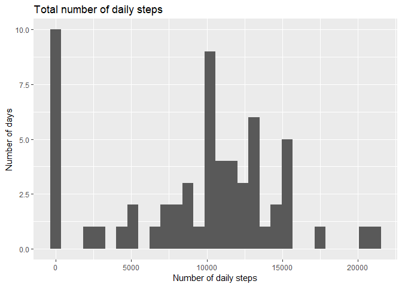
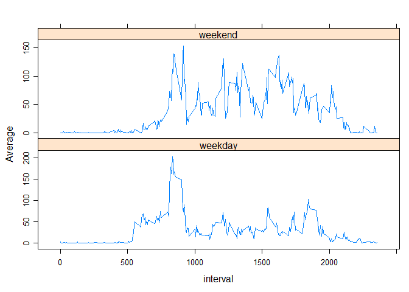

## Loading and preprocessing the data
Unzip the datafile and store data in Data. The date column is converted using lubridate. 

```r
suppressWarnings(suppressMessages(library(lubridate)))
rm(list = ls())

unzip("activity.zip")

Data = data.frame(read.csv("activity.csv"))

Data$DateTime <- ymd_hm(paste(Data$date, sprintf("%04d", Data$interval)))
Data$date <- ymd(as.character(Data$date))
```


## What is mean total number of steps taken per day?

To answer this question the total number of daily steps is calculated. Next the hystogram of the number of daily steps shown.

```r
suppressWarnings(suppressMessages(library(dplyr)))
suppressWarnings(suppressMessages(library(ggplot2)))

Data %>% group_by(date) %>% summarize(TotalSteps = sum(steps, na.rm = TRUE)) -> DailyTotalSteps

ggplot(data=DailyTotalSteps, aes(TotalSteps)) + geom_histogram() + labs(title="Total number of daily steps", x="Number of daily steps", y="Number of days")
```

```
## `stat_bin()` using `bins = 30`. Pick better value with `binwidth`.
```

<!-- -->

The mean and median of the total number of steps taken per day are:

```r
print(paste0("Mean: ", mean(DailyTotalSteps$TotalSteps, na.rm = TRUE)))
```

```
## [1] "Mean: 9354.22950819672"
```

```r
print(paste0("Median: ", median(DailyTotalSteps$TotalSteps, na.rm = TRUE)))
```

```
## [1] "Median: 10395"
```

## What is the average daily activity pattern?

Make a time series plot (i.e. \color{red}{\verb|type = "l"|}type="l") of the 5-minute interval (x-axis) and the average number of steps taken, averaged across all days (y-axis):

```r
Data %>% group_by(interval) %>% summarize(Average=mean(steps, na.rm = TRUE)) -> DailyPatern

ggplot(data=DailyPatern, aes(x=interval, y=Average)) + geom_line() + labs(title="Average number of steps", x="Interval", y="Average number of steps")
```

<!-- -->

Which 5-minute interval, on average across all the days in the dataset, contains the maximum number of steps?

```r
MaxAverage = DailyPatern[DailyPatern$Average==max(DailyPatern$Average),"interval"]

print(paste("Interval with maximum number of steps on average: ", MaxAverage))
```

```
## [1] "Interval with maximum number of steps on average:  835"
```


## Imputing missing values
Calculate and report the total number of missing values in the dataset (i.e. the total number of rows with \color{red}{\verb|NA|}NAs):

```r
print(paste("Number of incomplete rows: ",nrow(Data[!complete.cases(Data),])))
```

```
## [1] "Number of incomplete rows:  2304"
```

We will impute missing values by the interval average:

```r
Data %>% mutate(steps=ifelse(is.na(steps), as.numeric(DailyPatern[DailyPatern$interval==5,"Average"]),steps)) -> DataImputed
```

```
## Warning: package 'bindrcpp' was built under R version 3.5.1
```

The total number of steps taken each day across all days:

```r
DataImputed %>% group_by(date) %>% summarize(TotalSteps = sum(steps)) -> DailyTotalStepsImputed

ggplot(data=DailyTotalStepsImputed, aes(TotalSteps)) + geom_histogram() + labs(title="Total number of daily steps", x="Number of daily steps", y="Number of days")
```

```
## `stat_bin()` using `bins = 30`. Pick better value with `binwidth`.
```

<!-- -->

The mean and median of the total number of steps taken per day are:

```r
print(paste0("Mean: ", mean(DailyTotalStepsImputed$TotalSteps, na.rm = TRUE)))
```

```
## [1] "Mean: 9367.05722239406"
```

```r
print(paste0("Median: ", median(DailyTotalStepsImputed$TotalSteps, na.rm = TRUE)))
```

```
## [1] "Median: 10395"
```

The distribution of the total number of steps taken is for the imputed dataset slightly different in the 10000 to 16000 range. 

However, the total median are unaffected, while the mean is slightly higher. 


## Are there differences in activity patterns between weekdays and weekends?

Create the factor:

```r
DataImputed$DayType <- weekdays(DataImputed$date, abbreviate = TRUE)
DataImputed %>% mutate(DayType=ifelse(DayType %in% c("Sat","Sun"),"weekend","weekday")) -> DataImputed
DataImputed$DayType <- as.factor(DataImputed$DayType)
```


```r
library(lattice) 

DataImputed %>% group_by(interval, DayType) %>% summarize(Average=mean(steps, na.rm = TRUE)) -> DayTypePatern

xyplot(Average~interval|DayType,data=DayTypePatern,type="l",
       scales=list(y=list(relation="free")),
       layout=c(1,2))
```

<!-- -->

Yes there is a clear difference in the average steps between weekend and weekdays. On weekdays the average number of steps spikes between 8:00 and 9:00, while in the weekend the average number of steps is more even distributed between 8:00 and 22:00. 
